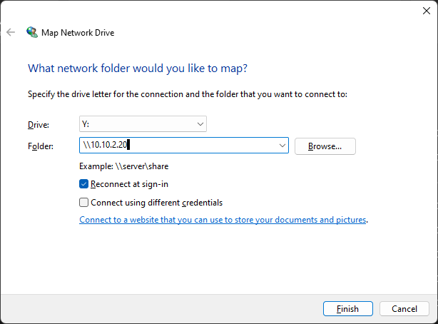
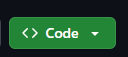

# Home Assistant (HAOS)

## How to Add HAOS File System to Yours

To access the file system of HAOS using your file explorer, follow these steps:

1. Open File Explorer by pressing `Windows + E` or navigating to it.
2. Right-click on "This PC" and select "Map network drive".
3. Enter the IP address of your HAOS as shown below and click "Browse".

  

4. Enter the credentials of an account that has access rights to the files.
5. Navigate to the folder you want to access.
6. Click "Finish". You can now access this folder through your file explorer like any other folder.

## How to Import the Backup

1. Go to the [GitHub repository](https://github.com/vives-project-xp/GreenhouseNetwork-Monitoring).
2. Click on the "Code" button.

  

3. Download the repository as a ZIP file or clone it.
4. Once you have access to the files, paste the `custom-components` and `www` folders into the `.config` folder of HAOS. Do the same with the `ui-lovelace.yaml` and `configuration.yaml` files.

## How to Customize More

⚠️ Use the [Home Assistant documentation](https://developers.home-assistant.io/docs/development_index) for further customization.

### Adding Cards to the Dashboard

```yaml
views:
  - title: Home
   path: home
   type: custom:custom-view
   badges: []
   cards:
    - camera_view: live
      type: picture-glance
      entities:
       - entity: binary_sensor.m5525_e_0_vmd3_0
       - entity: binary_sensor.m5525_e_0_sound_1
      camera_image: camera.m5525_e_0
      entity: camera.x
    - camera_view: live
      type: picture-glance
      entities:
       - entity: binary_sensor.p1435_le_0_daynight_1
      camera_image: camera.p1435_le_0
```

As shown above, two cards have been added.

You can also create your own integrations, cards, or views.

### Custom Cards/Views

To create custom cards or views, follow these steps:

1. Create a folder in `www` with a name that fits the custom card/view.
2. Create an `index.js` file where you will import everything.
3. Work in files other than `index.js` to keep the code clean and manageable.
4. Add the following to `configuration.yaml`:

  ```yaml
  lovelace:
    mode: yaml
    resources:
     ... # other modules
     - url: /local/path/to/file/index.js
      type: module
     ... # other modules
  ```